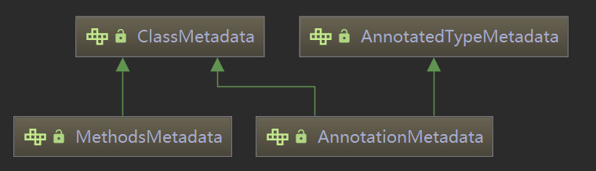
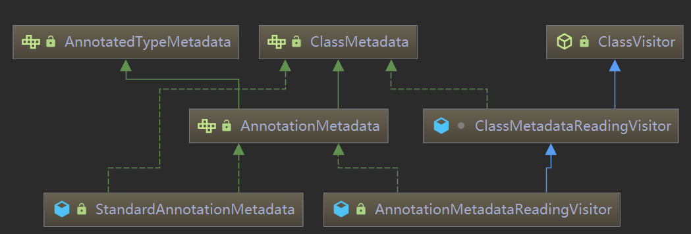
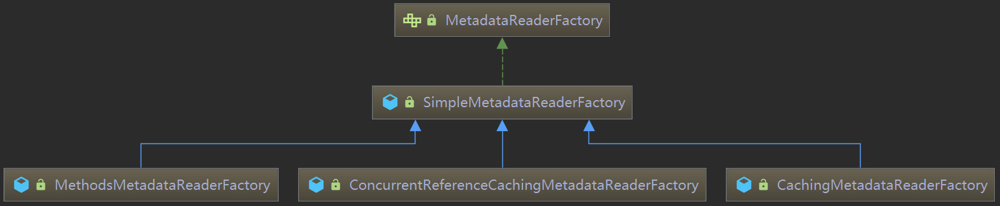

`AnnotationMetadata`在spring中使用非常官方广泛，读取类的元数据（注解）接口，在spring 2.5.x以后就提供了两种实现，一种基于 Java 反射的`StandardAnnotationMetadata`，另一种基于 ASM 框架的`AnnotationMetadataReadingVisitor`他们应用的场景也各不相同。

**元数据**

spring的元数据接口是`ClassMetadata`，而对于一般开发者使用的就是`AnnotationMetadata`和`MethodsMetadata`



**`AnnotationMetadata`的实现类图**



<font color=#969896>注：本文基于spring-boot-starter-parent 2.1.3.RELEASE（Spring 5.1.5.RELEASE）</font>

#### `StandardAnnotationMetadata`

反射的特点是需要进行复杂的类加载，获取类上的元数据速度较慢。

**用法**

`StandardAnnotationMetadata`的使用还是非常的简单。

```java
@Api(value = "设置")
@RestController
@RequestMapping(value = "/setting")
public class ActivitySettingFacadeImpl implements ActivitySettingFacade {
    public static void main(String[] args) throws IOException {
        AnnotationMetadata reflectReader = new StandardAnnotationMetadata(ActivitySettingFacadeImpl.class);
        System.out.println(reflectReader.getAnnotationTypes());
    }
}
```

**使用场景**

比如在`AnnotatedGenericBeanDefinition`（居于`BeanDefinition`的注解的实现）中应用，其实非常广泛，这里就不再列举。

#### `AnnotationMetadataReadingVisitor`

它的好处在于不需要复杂的类加载，速度非常快。

**用法**

```java
    public static void main(String[] args) throws IOException {
        CachingMetadataReaderFactory readerFactory = new CachingMetadataReaderFactory();
        Resource resource = new ClassPathResource("ActivitySettingFacadeImpl.class",ActivitySettingFacadeImpl.class);
        AnnotationMetadata asmVisitor = readerFactory.getMetadataReader(resource).getAnnotationMetadata();
        System.out.println(asmVisitor.getAnnotationTypes());
    }
```

**原理**

`AnnotationMetadataReadingVisitor`则稍稍复杂点，了解到它借助了`org.springframework.asm.ClassReader`足矣。而`SimpleMetadataReader`则是对其进行了封装，

```java
//源自org.springframework.core.type.classreading
final class SimpleMetadataReader implements MetadataReader {
	private final Resource resource;
	private final ClassMetadata classMetadata;
	private final AnnotationMetadata annotationMetadata;
	SimpleMetadataReader(Resource resource, @Nullable ClassLoader classLoader) throws IOException {
		InputStream is = new BufferedInputStream(resource.getInputStream());
		ClassReader classReader;
		try {
			classReader = new ClassReader(is);
		}
		catch (IllegalArgumentException ex) {
			throw new NestedIOException("ASM ClassReader failed to parse class file - " +
					"probably due to a new Java class file version that isn't supported yet: " + resource, ex);
		}
		finally {
			is.close();
		}
		AnnotationMetadataReadingVisitor visitor = new AnnotationMetadataReadingVisitor(classLoader);
		classReader.accept(visitor, ClassReader.SKIP_DEBUG);//此时是精髓

		this.annotationMetadata = visitor;
		// (since AnnotationMetadataReadingVisitor extends ClassMetadataReadingVisitor)
		this.classMetadata = visitor;
		this.resource = resource;
	}
	@Override
	public Resource getResource() {
		return this.resource;
	}
	@Override
	public ClassMetadata getClassMetadata() {
		return this.classMetadata;
	}
	@Override
	public AnnotationMetadata getAnnotationMetadata() {
		return this.annotationMetadata;
	}
}
```

并提供了工厂类接口`MetadataReaderFactory`，实现也比较多：`CachingMetadataReaderFactory`



**使用场景**

1. `@Configuration`，具体的逻辑在 `ConfigurationClassPostProcessor`中有应用，采用了`CachingMetadataReaderFactory`来读取某些class
2.  [`@Import`注入](https://blog.csdn.net/alex_xfboy/article/details/89408918)（用到了`ImportSelector`)，具体的实现逻辑在`AutoConfigurationImportSelector`，排序并处理`@AutoConfigureBefore`和 `@AutoConfigureAfter`逻辑采用了`CachingMetadataReaderFactory`。
